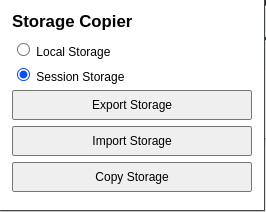

# Storage Copier

Storage Copier is a simple browser extension that allows you to quickly export and import localStorage or sessionStorage data between tabs and domains. With just a few clicks, you can copy all storage data from one site and inject it into another, making it easy to test, migrate, or synchronize web app data across environments.

## Features

- Export localStorage or sessionStorage from any website.
- Import storage data into another tab or domain.
- Easy-to-use popup interface.
- Supports all regular websites.

## Screenshot

## How to Use

1. Open the extension popup by clicking the extension icon in the browser toolbar.
2. Select the storage type (localStorage or sessionStorage).
3. Click "Export Storage" to save the storage data from the current tab.
4. Switch to another tab or domain and click "Import Storage" to inject the saved data.

## Installation

1. Clone or download this repository.
2. Open your browser and navigate to `chrome://extensions/`.
3. Enable "Developer mode" in the top-right corner.
4. Click "Load unpacked" and select the project folder.

## Permissions

This extension requires the following permissions:

- `storage`: To temporarily save exported storage data.
- `tabs`: To identify and interact with the active tab.
- `host_permissions`: To inject content scripts into web pages.

## License

This project is licensed under the MIT License.
